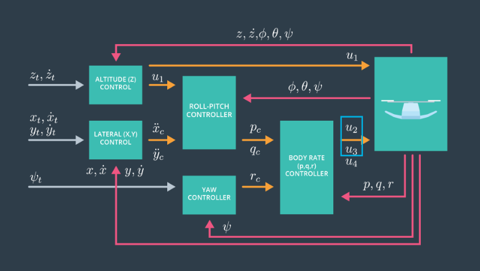
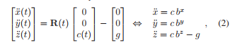
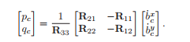
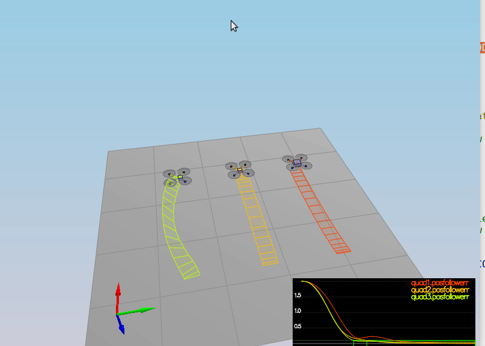
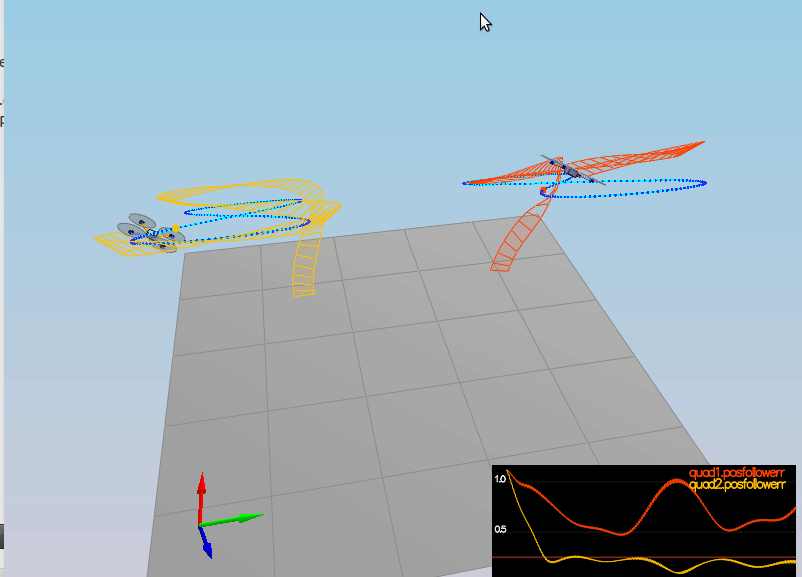
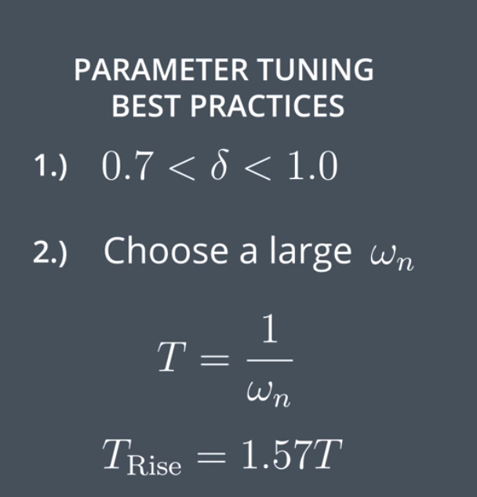
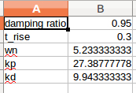

# Control of a 3D Quadrotor #

This project implements a PID controller for a 3D Quadrotor in C++, and fine tune PID gains to control a drone to follow trajectories under several scenarios.


## Controller implementation ##

A cascaded PID controller is designed to control the drone. The overall architector the controller is as below,



Below is the detailed descriptions for each component in the controller.

### body rate control  ###


Body rate controller is a proportional controller. its input are body rates (p,q,r) in body frame and it outputs body rotation acceleration (p_dot, q_dot, r_dot). It then proceeds to use mometns of inertial of the drone (Ixx, Iyy, Izz) to compute command moments (Mx, My, Mz) in body frame.

###  roll pitch control ###

Roll pitch control is a proportional controller, 

its inputs includes:  
1. desired acceleration in inertia frame,  x_dot_dot, y_dot_dot  
2. desired collective thrust of the quad, u_1  
3. current or estimated attitude of the vehicle, roll, pitch, yaw

its output are:
1. desired pitch and roll rates(p_c, q_c)

Below is the general steps in the component:

1. calculate the thrust acceleration in body frame c = u_1/mass
2. calculate commanded rotation matrix entries b_x_c, and b_y_c by using the acceleation mapping between inertial frame and body frame. The mapping is decribed by R, the rotatio matrix generated by current attitude(roll, pitch, yaw).



3. Use a P controller to output b_x_dot, b_y_dot, which is esentially related to rotation rate in inertia frame.

4. b_x_dot, b_y_dot. are directly mapped to the commanded angular body
velocities (p_c, q_c) using below equation,



### altitude control###

altitude controller is a PID controller.
Its inputs:
1. desired vertical position and velocity in inertia frame
2. current vertical position and velocity in inertia frame
3. feed-forward vertical acceleration in inertia frame
4. the time step of the measurements  

Its output:
 a collective thrust command in body frame

It is just a regular PID controller, with two additional points,

1. desired velocity are contrained to make sure they stay in drone physical limits.
2. the generate z_dot_dot in inertail will be converted to collective thrust acceleation in body frame with below equation.


### lateral position control  ###

It is a PD controller. 

Its input:
1. desired position and velocity in inertia frame
2. current position and velocity in inertia frame
3. feed-forward acceleration

Its output:
1. desired horizontal accelerations, x_dot_dot, y_dot_dot

This is a very simple PD controller, there is coordiante system mapping involved, everything is done in inertia frame. It also contrained desired velocity and acceleration to make sure they stay in drone limit.

### yaw control  ###

It is a P controller.

Its input:
1. commanded yaw
2. current yaw 

its output:
1. desired yaw rate(r_c)

### motor commands output ###

The thrust and moments should be converted to the appropriate 4 different desired thrust forces for the moments

Below is the main equation used.

```
F_tot = F0 + F1 + F2 + F3
tau_x = (F0 - F1 + F2 - F3) * l                 // This is Roll
tau_y = (F0 + F1 - F2 - F3) * l                 // This is Pitch
tau_z = (-F0 + F1 + F2 - F3) * kappa      // This is Yaw
```

## Flight Evaluation ##

The final controller is able to pass the test in all five scenarios.

Below is a the gifs for scenario 4 and 5.

<p align="center">

</p>

<p align="center">

</p>

## Parameter tuning ##

PID gain paramter tuning is the most interesing part of this project. At the end, the parameters are mainly tuned with the help of rise time and settling time, as described in [lecture](https://classroom.udacity.com/nanodegrees/nd787/parts/5aa0a956-4418-4a41-846f-cb7ea63349b3/modules/b78ec22c-5afe-444b-8719-b390bd2b2988/lessons/dd98d695-14f1-40e0-adc5-e9fafe556f73/concepts/541ec6ae-f171-4195-9c05-97a5c82a85df)






## Reflection ##

I am kind of lagging behind project submission schedule due to other commitments. In terms of further improving this project, I can think of two items.

1. Explore the trajectory generation portion of this projects (given discrete planning waypoints)
2. Explore how to fly the trajectory as quickly as possible